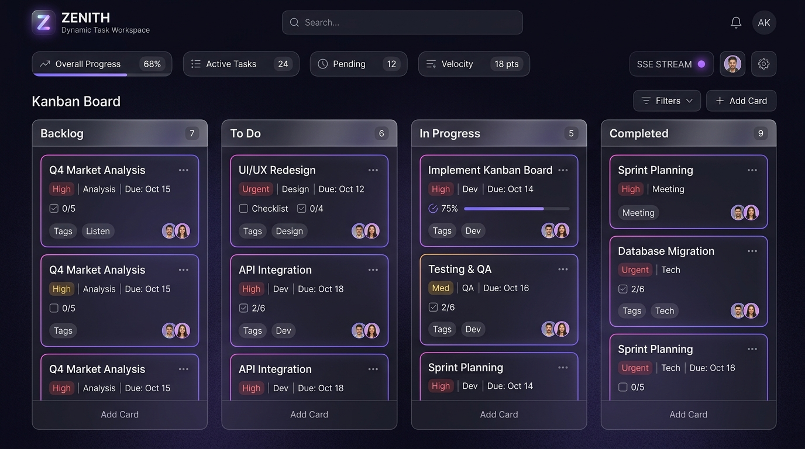
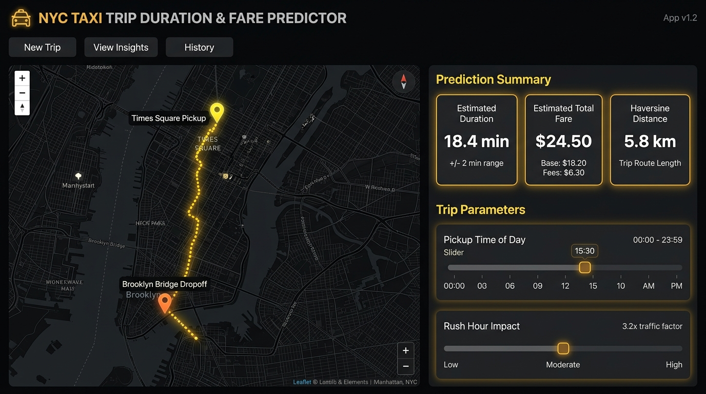
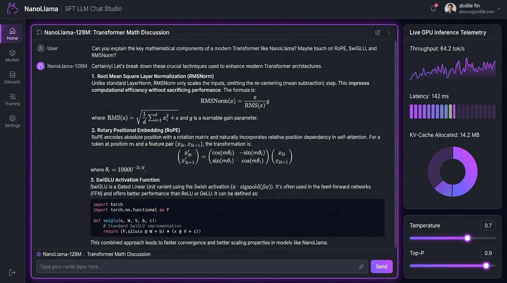
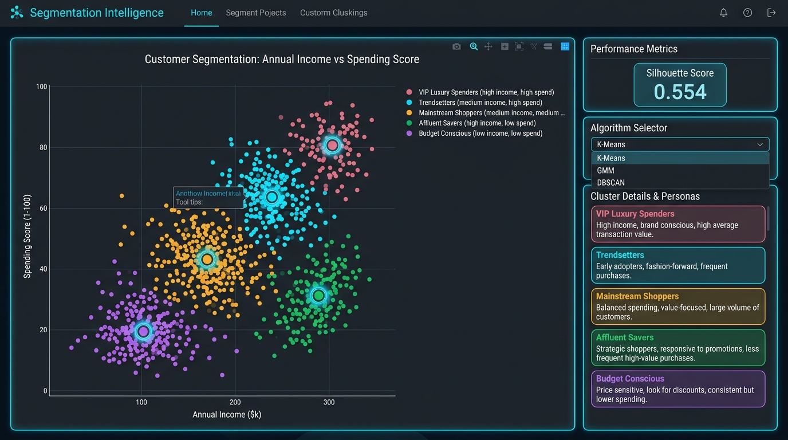
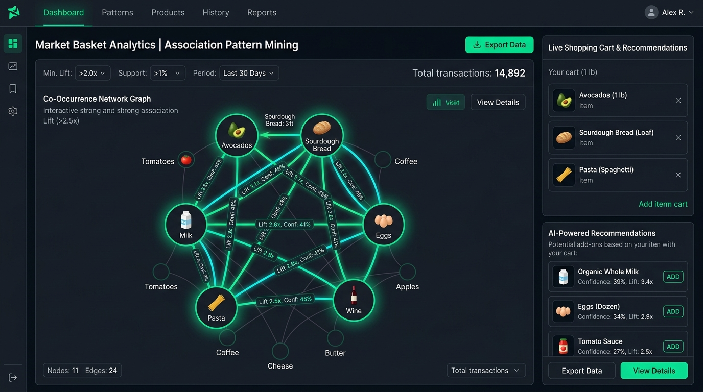
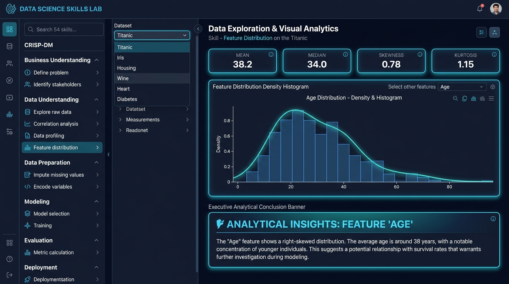

# 🌟 Enterprise Data Science, Machine Learning & AI Applications Portfolio

A comprehensive, production-grade portfolio of **6 Full-Stack Data Science, Machine Learning, Deep Learning, and Intelligent Web Systems (Projects 00 through 05)**, engineered adhering to the **CRISP-DM standard**, rigorous mathematical foundations, interactive data science administration dashboards, and state-of-the-art UX.

---

## 🏛️ Comprehensive Systems Portfolio Index (6 Projects)

| # | System Title & Directory | Domain & Methodology | Backend Port | Frontend Port | Primary Screenshot Preview |
|---|---|---|:---:|:---:|:---:|
| **0** | [**Zenith Dynamic Task Workspace**](./00_dynamic_todo_workspace) | Full-Stack Reactive Task Workspace & SSE Telemetry | `5001` | `5173` |  |
| **1** | [**NYC Taxi Trip Prediction**](./01_nyc_taxi_trip_prediction) | CRISP-DM Spatial Regression & AutoResearch | `8000` | `5174` |  |
| **2** | [**NanoLlama SFT LLM**](./02_nano_llm_transformer) | PyTorch Autoregressive Transformer (RoPE, SwiGLU, SFT) | `8002` | `5175` |  |
| **3** | [**Customer Clustering**](./03_customer_segmentation_clustering) | Topological Partitioning & AutoResearch | `8003` | `5176` |  |
| **4** | [**Market Basket Mining**](./04_associative_pattern_mining) | Apriori & FP-Growth Pattern Affinity | `8004` | `5177` |  |
| **5** | [**DS Skills Mastery Lab**](./05_data_science_skills_lab) | 54 Analytical Skills & Kaggle Benchmarks | `8005` | `5178` |  |

---

## 🎯 Verbatim Reproduction Prompt Catalog, Implementation Plans & Walkthroughs

* **Prompt Catalog**: Every prompt used to generate, iterate, and verify these applications is cataloged chronologically in 👉 **[PROMPTS.md](./PROMPTS.md)**
* **Project 0 Implementation Plan**: [`00_dynamic_todo_workspace/IMPLEMENTATION_PLAN.md`](./00_dynamic_todo_workspace/IMPLEMENTATION_PLAN.md)
* **Project 1 Implementation Plan**: [`01_nyc_taxi_trip_prediction/IMPLEMENTATION_PLAN.md`](./01_nyc_taxi_trip_prediction/IMPLEMENTATION_PLAN.md)
* **Project 2 Implementation Plan**: [`02_nano_llm_transformer/IMPLEMENTATION_PLAN.md`](./02_nano_llm_transformer/IMPLEMENTATION_PLAN.md)
* **Project 3 Implementation Plan**: [`03_customer_segmentation_clustering/IMPLEMENTATION_PLAN.md`](./03_customer_segmentation_clustering/IMPLEMENTATION_PLAN.md)
* **Project 4 Implementation Plan**: [`04_associative_pattern_mining/IMPLEMENTATION_PLAN.md`](./04_associative_pattern_mining/IMPLEMENTATION_PLAN.md)
* **Project 5 Implementation Plan**: [`05_data_science_skills_lab/IMPLEMENTATION_PLAN.md`](./05_data_science_skills_lab/IMPLEMENTATION_PLAN.md)

---

## 🛠️ Global Quick Start & One-Line Execution

### 1. Prerequisites
* Python 3.10+ (with `torch`, `fastapi`, `uvicorn`, `scikit-learn`, `pandas`, `numpy`)
* Node.js 18+ (with `npm`)

### 2. Running Any Application from Root via `run_demo.sh`
You can launch any project's complete stack (backend + frontend) with a single command from the root repository:

```bash
# Make script executable
chmod +x run_demo.sh

# Run individual projects:
./run_demo.sh 0   # Zenith Dynamic Task Workspace (Ports 5000 / 5173)
./run_demo.sh 1   # NYC Taxi Trip Duration Predictor (Ports 8000 / 5174)
./run_demo.sh 2   # NanoLlama SFT LLM Studio (Ports 8002 / 5175)
./run_demo.sh 3   # Customer Clustering Intelligence (Ports 8003 / 5176)
./run_demo.sh 4   # Market Basket Pattern Mining (Ports 8004 / 5177)
./run_demo.sh 5   # Data Science Skills Mastery Lab (Ports 8005 / 5178)
```

### 3. Manual Launching
```bash
# Example: Launching NYC Taxi Trip Duration Predictor
cd 01_nyc_taxi_trip_prediction/backend
python -m uvicorn main:app --host 127.0.0.1 --port 8000

# In another terminal:
cd 01_nyc_taxi_trip_prediction/frontend
npm run dev # http://localhost:5174
```
